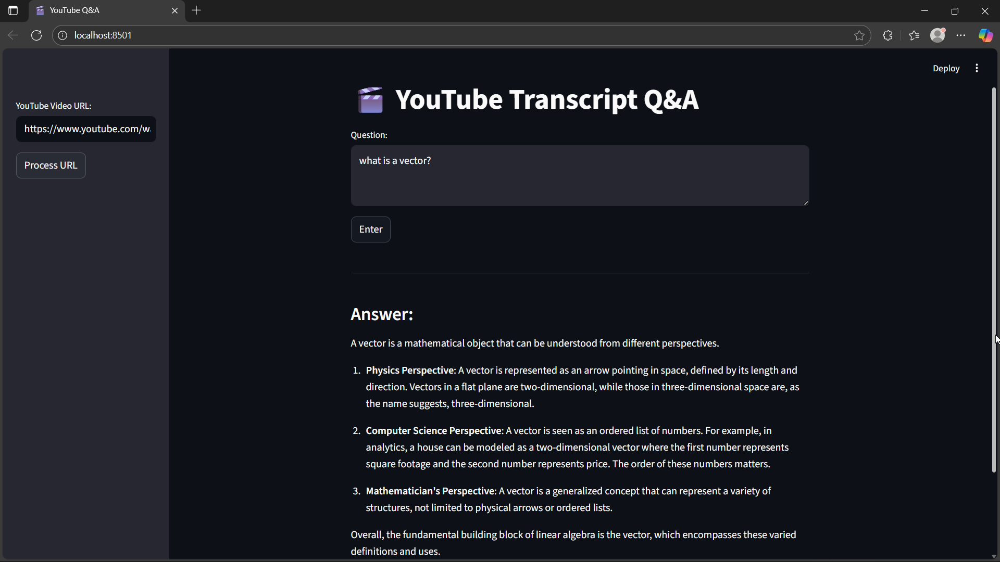

# 🎬 YouTube Transcript Q&A

A simple **Retrieval-Augmented Generation (RAG)** web app that lets you **ask questions about any YouTube video** and get AI-generated answers from its transcript.  
Built with **LangChain**, **OpenAI**, **Chroma**, and **Streamlit**.

---

## ✨ Features
- ✅ Automatically fetches the **YouTube transcript** (if available)
- ✅ **Chunks and stores** the transcript in a **Chroma vector database**
- ✅ Uses **OpenAI GPT-4o-mini** to answer questions based on the transcript
- ✅ Clean and interactive **Streamlit web interface**

---

## 🛠️ Tech Stack
- [Python 3.10+](https://www.python.org/)
- [LangChain](https://www.langchain.com/)
- [OpenAI API](https://platform.openai.com/)
- [Chroma Vector DB](https://www.trychroma.com/)
- [Streamlit](https://streamlit.io/)
- [YouTube Transcript API](https://pypi.org/project/youtube-transcript-api/)

---

## 🚀 Setup & Installation

### 1️⃣ Clone the repository
```bash
git clone https://github.com/<your-username>/<your-repo-name>.git
cd <your-repo-name>
```

### 2️⃣ Create & activate a virtual environment
```bash
python -m venv venv
# Windows
venv\Scripts\activate
# macOS / Linux
source venv/bin/activate
```

### 3️⃣ Install dependencies
```bash
pip install -r requirements.txt
```

### 4️⃣ Add your OpenAI API Key
Create a **.env** file in the project root:
```
OPENAI_API_KEY=your_openai_api_key_here
```

---

## ▶️ Run the App
```bash
streamlit run app.py
```

- Open the provided **local URL** in your browser.
- Enter any **YouTube video URL** in the sidebar.
- Click **Process URL** to load the transcript.
- Ask a question in the text area and click **Enter** to get an AI-generated answer.

---

## 🖼️ Sample Output

Below is a screenshot of the running application:



---

## 📂 Project Structure
```
.
├── app.py                  # Streamlit web app
├── rag_utils.py            # Core RAG logic (transcript fetching, QA)
├── template.json           # Prompt template for LangChain
├── requirements.txt        # Python dependencies
├── .env.example            # Example environment file
├── docs/
│   └── sample_output.png   # Screenshot used in README
└── resources/
    └── vector_store/       # Chroma persistent vector database
```

---

## ⚠️ Notes
- The YouTube video **must have transcripts enabled**.
- First run will create a **persistent Chroma DB** inside `resources/vector_store`.
- Make sure you have sufficient **OpenAI API quota**.

---

## 🧑‍💻 Author
**Sharanch Mukhia**  
📧 [saranchmukhia@gmail.com](mailto:saranchmukhia@gmail.com)

---

> 💡 This project demonstrates how to combine **LLMs + Vector Databases + Streamlit** to create an interactive RAG application.
